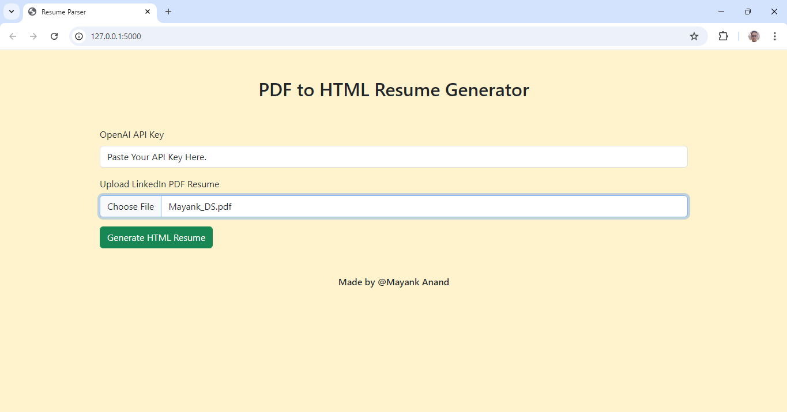

# Resume-Parser
Resume-Parser is a web-based application that allows users to upload a LinkedIn PDF resume and generate a structured HTML version of a resume. The application uses the OpenAI API or the Hugging Face model to convert extracted text from PDF to HTML format, making it easier for users to upload or share their resume on a website structured, readable format

## Features
- Upload a LinkedIn PDF resume.
- Extract text from PDF.
- It converts the selected text into a structured HTML format using an AI-based language model.
- It displays the restarted HTML in the web browser, ready to download or edit.

## Why OpenAI API or Hugging Face?
The application uses AI language models, such as OpenAI GPT or Hugging Face GPT-like models, to convert raw repeated text into a structured HTML format These models can understand text and convert it to a human readable format , ensure that output HTML is clean, well formatted and logically correct

Accessing the language model requires the use of an OpenAI API key, which allows the app to send information back to the model and receive HTML output in response. In the absence of this key, the app could not acquire this advanced AI power.

## Inputs 
This website takes two inputs:
- LinkedIn PDF Resume : The user uploads their resume in PDF format. The system parses this PDF and extracts the text.
- OpenAI API Key : The user must provide his/her OpenAI or Hugging Face API key. This key is needed to validate the language system and use it to generate the HTML version of the resume.

## Output
The output of the project is an HTML-formatted resume, which is generated using PDF text. The resulting HTML file :
- Include topics, relevant sections (e.g., education, work experience), bullet points, and other formats.
- It will be displayed in a clean and organized manner on the website.
- Users can view, download, or create a custom HTML genrated.

## Approach
- Frontend :
  - Created an HTML form using Bootstrap to allow users to upload their PDF resume and provide their OpenAI API key.
  - Once the form is submitted, the PDF is uploaded to the backend.

- Backend (Flask) :
  - Created a Flask application that handles file uploads and extracts the text from the PDF using the PyMuPDF library (fitz).
  - Designed a function (process_resume) that interacts with the OpenAI API (or Hugging Face models) to send the extracted PDF text and receive a well-structured HTML format in return.
  - Managed concurrency using Python's threading and lock to avoid race conditions when processing requests.

- PDF Text Extraction :
  - Used PyMuPDF to extract the raw text from the uploaded LinkedIn PDF.
  - Processed the extracted text to prepare it for conversion into HTML format.
    
- AI-Powered Conversion :
  - Sent the PDF text to the OpenAI API (or Hugging Face) with a prompt asking it to generate a structured HTML version of the text.
  - The AI model processes the input and returns an HTML response, which is then rendered on the frontend as a formatted resume.
    
- Error Handling :
  - Added error handling to ensure that invalid API keys, file types, or API request issues are managed gracefully, displaying appropriate messages to the user.

## Preview of the Website




## How to Run Locally
- Clone the repository :
  ```javascript
  git clone https://github.com/mayankanand2701/Resume-Parser.git
  cd Resume-Parser
  ```
- Install the required dependencies :
  ```javascript
  pip install -r requirements.txt
  ```
- Run the Flask app (on the terminal) :
   ```javascript
  flask run
  ```

## Requirements
- Python
- Flask
- PyMuPDF
- Requests (for API calls)
- OpenAI API Key or Hugging Face API Key

## Challenges Faced
During the development of the Resume-Parser, I encountered an issue with the OpenAI API :
```javascript
  Error processing resume : You exceeded your current quota, please check your plan and billing details.
```
This occurred because my OpenAI API key exceeded its usage limits, which temporarily restricted access to the language model required for generating HTML resumes. However, this presented an opportunity to dive deeper into the underlying mechanisms of API usage, quotas, and rate limits.

## Enhancements of the future
- Add more customization options to the created HTML resume, such as themes or additional formatting options.
- Add the ability to download generated HTML iterations directly as files.
- Support PDF resume formats other than LinkedIn.

## License
This project is open-source and available under the MIT License.
